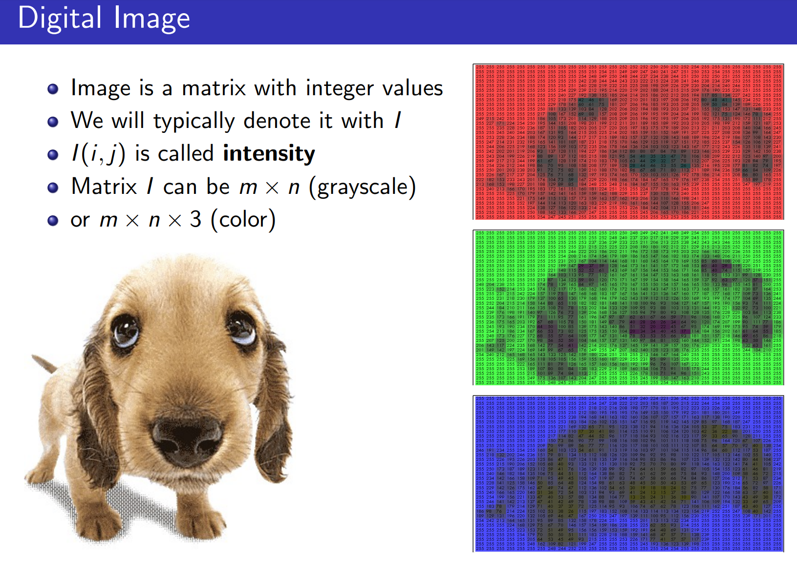
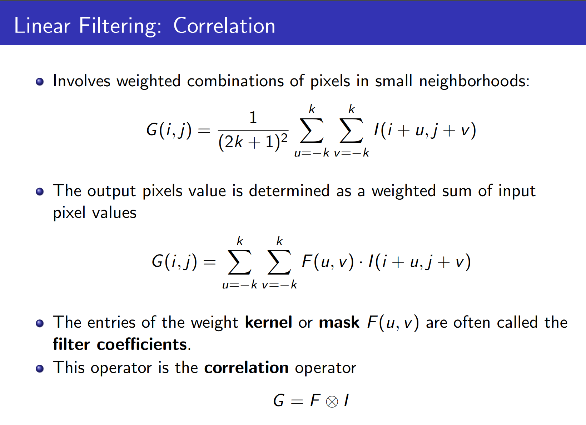
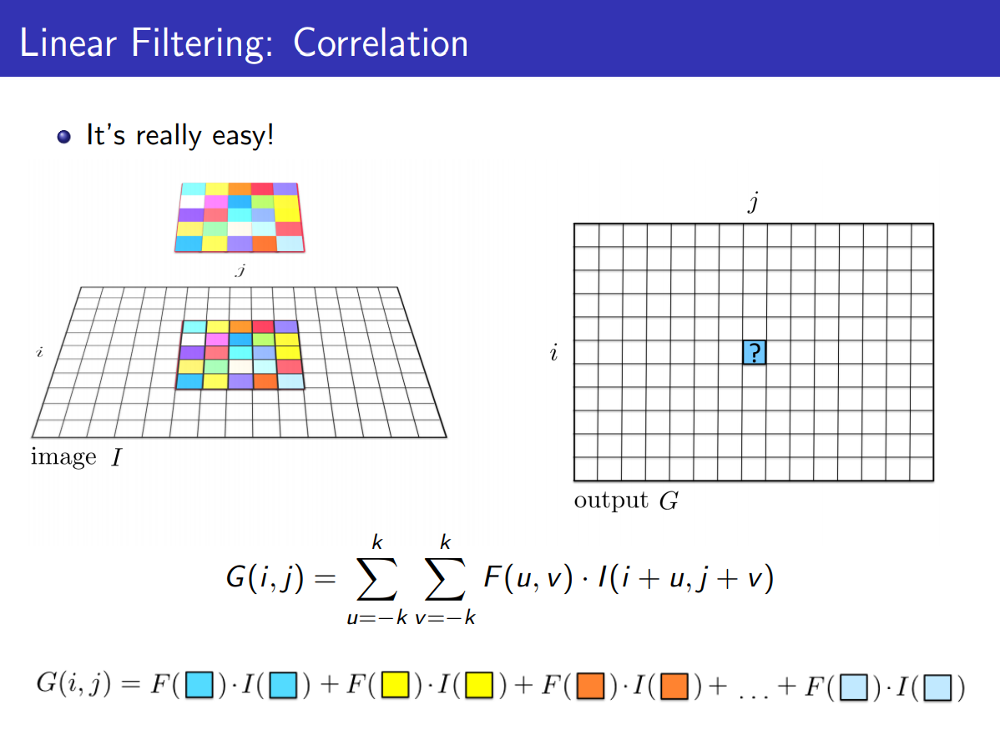
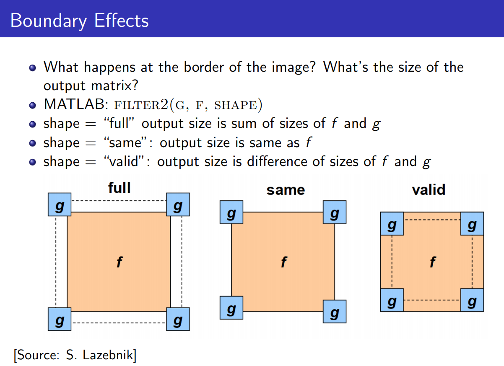
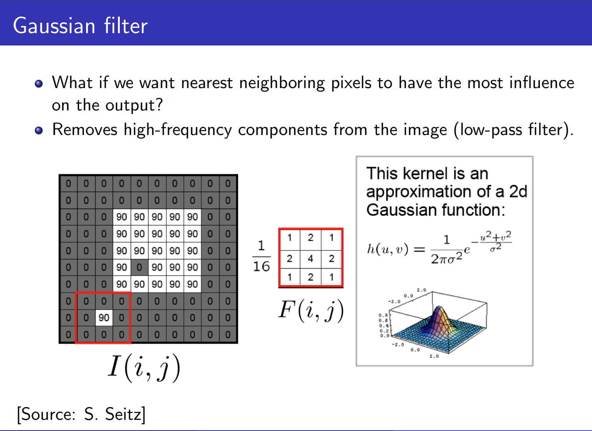
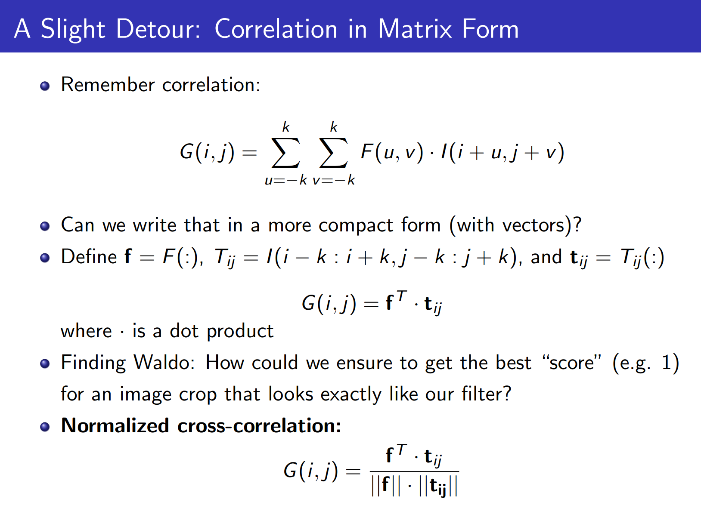
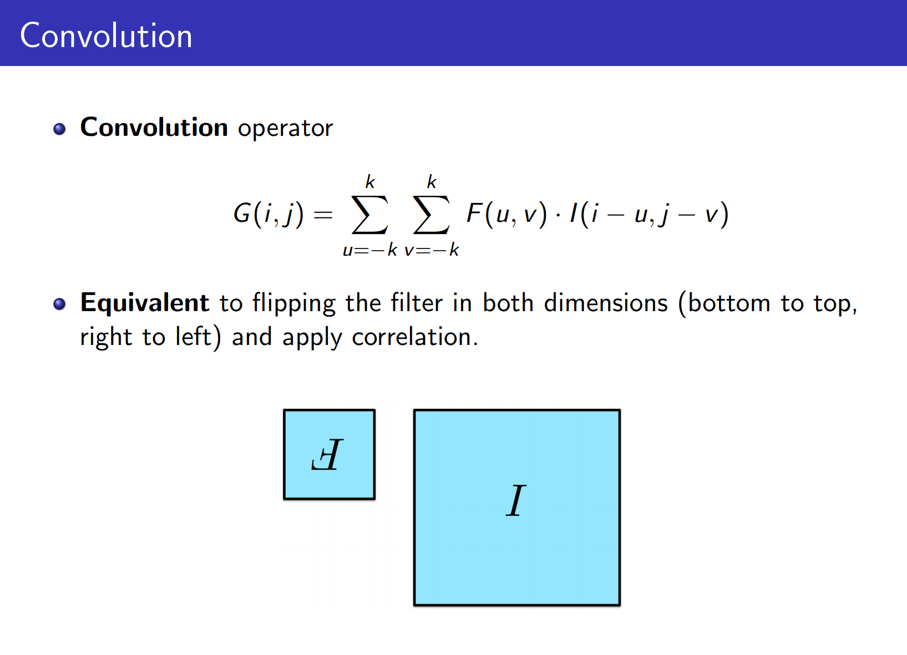
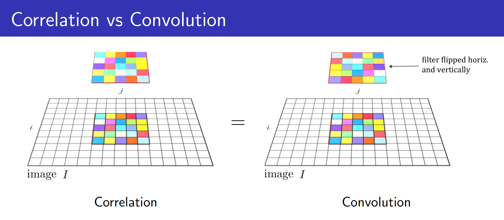
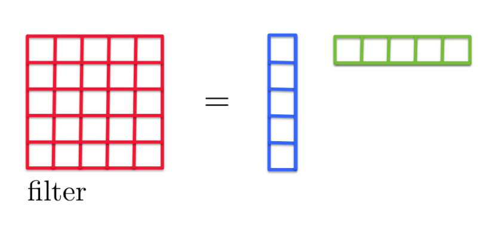
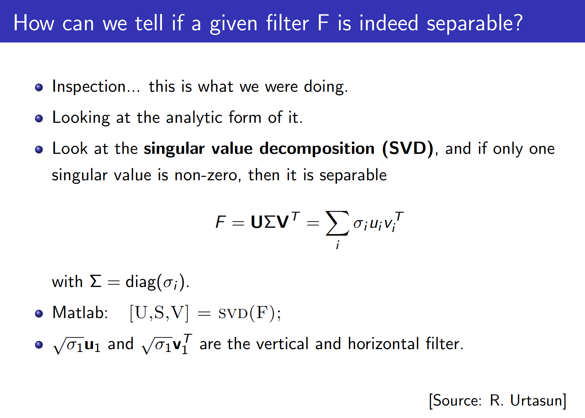

__Intensity__: We can think of a (grayscale) image as a function $f : R^2 \rightarrow  R$ giving the intensity at position $(i, j)$

Intensity 0 is black and 255 is white.

__Filtering__:  Modify the pixels in an image based on some function of a local neighborhood of each pixel.

__Applications of Filtering__:

- denoise: Enhance an image
- template matching: Detect pattern
- Texture and edge detection: Extract info







__smoothing__: removing high_frequency components from the image (low-pass filter)



```python
import cv2
# Define a kernel size for Gaussian smoothing / blurring
kernel_size = 3 #  they both must be positive and odd
blur_gray = cv2.GaussianBlur(gray,(kernel_size, kernel_size))
```

**Properties of the Smoothing:** (such as Gaussian filter)

- All values are positive
- They all sum to 1
- Amount of smoothing is proportional to mask size
- remove high-frequency components; (low-pass filter)

Note: This holds for smoothing filters only, not general filters

**Template Matching:**



And put a bounding box (rectangle the size of the template) at the point!

__Convolution__:





**Properties of convolution:**

- Commutative
- Associative
- Distributive
- Assoc. with scalar multiplier

Note: The Fourier transform of two convolved images is the product of their individual Fourier transforms: $\mathcal{F}(f*g) = \mathcal{F}(f) . \mathcal{F}(g)$.

Note: Convolving twice with Gaussian kernel of width $\sigma$ is the same as convolving once with kernel of width $\sigma\sqrt{2}$.

__Separable Filters__: (speed-up trick!)



- If the convolution filter is separable, the convolution can be  speed up by first performing a 1D horizontal convolution followed by a 1D vertical convolution. (requiring only $2K$ operations instead of $K^2$)  $F = v \times h^T$.


