# Edge detection

- Maps image to a set of __curves__ or __line segments__ or __contours__.
- More compact than pixels
- Edges are invariant to changes in illumination
- important for recognition
- important for various applications

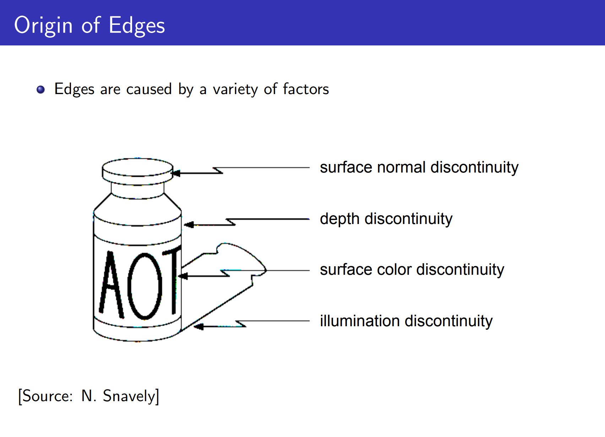

Characterizing edges:

- An __edge__ is a place of rapid change in the image intensity function.

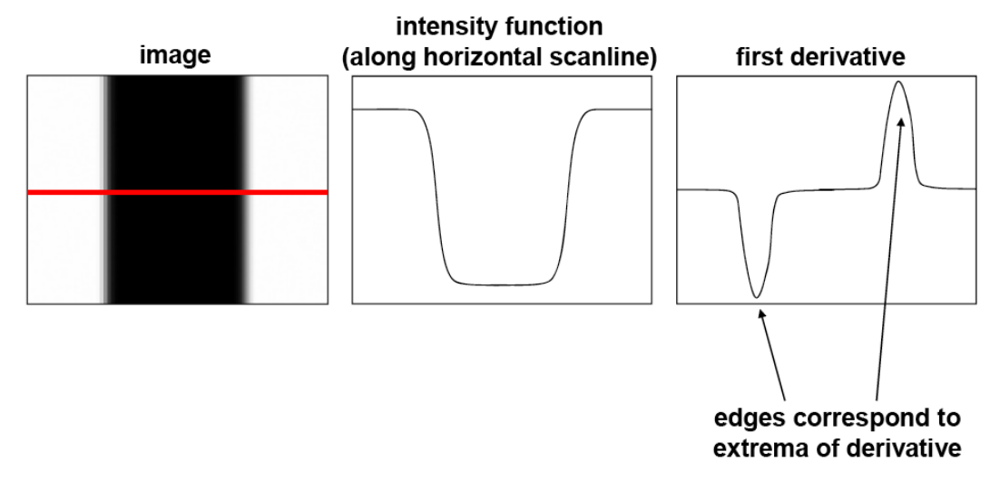

Differentiate a digital image $f[x,y]$, Since it is discrete, (finite difference): $\frac{\partial{f(x,y)}}{ \partial{x}} \approx \frac{f[x+1,y]-f[x]}{1}$

Therefore, horizontal (convolution) filter ($\frac{\partial{f(x,y)}}{ \partial{x}}$) : $[-1, 1]$ and vertical filter ($\frac{\partial{f(x,y)}}{ \partial{y}}$): $[-1,1]^T$.

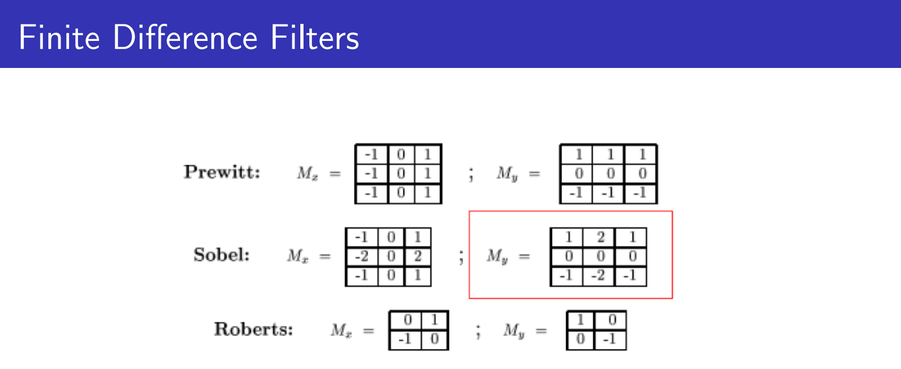

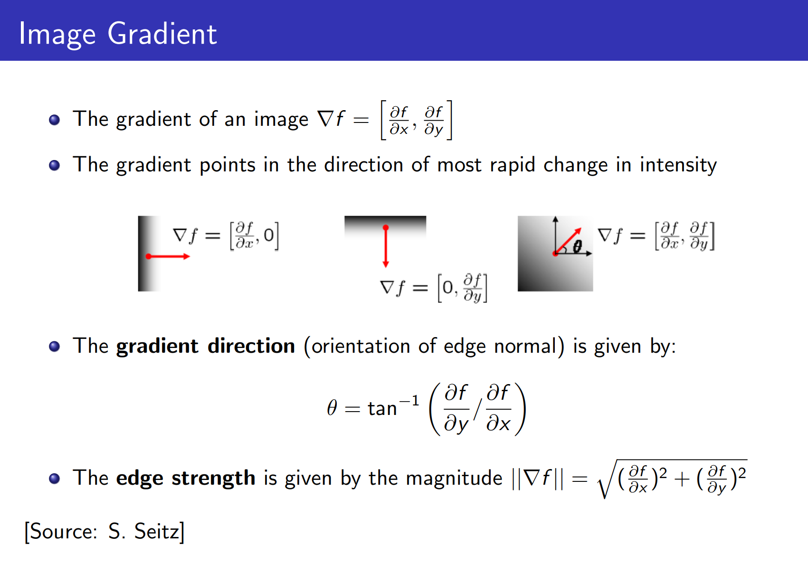

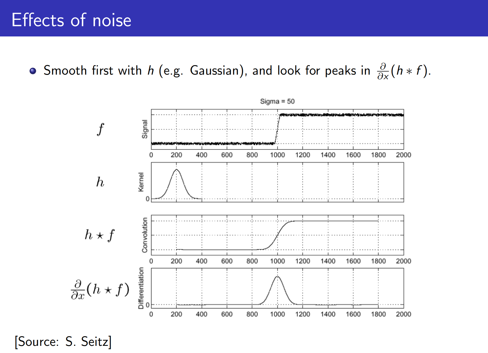


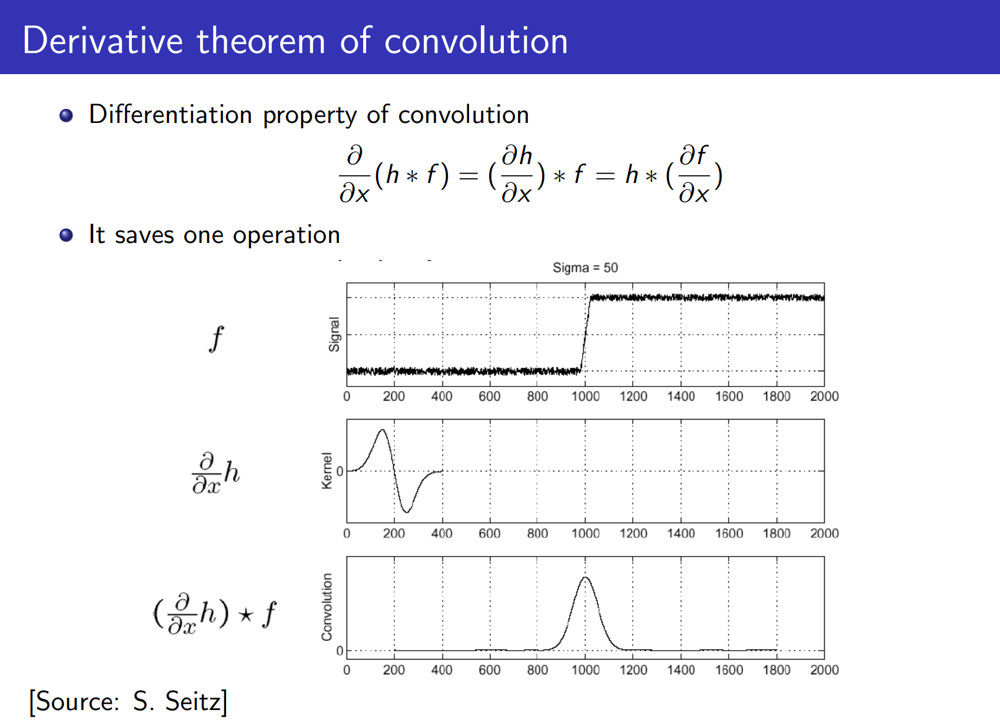

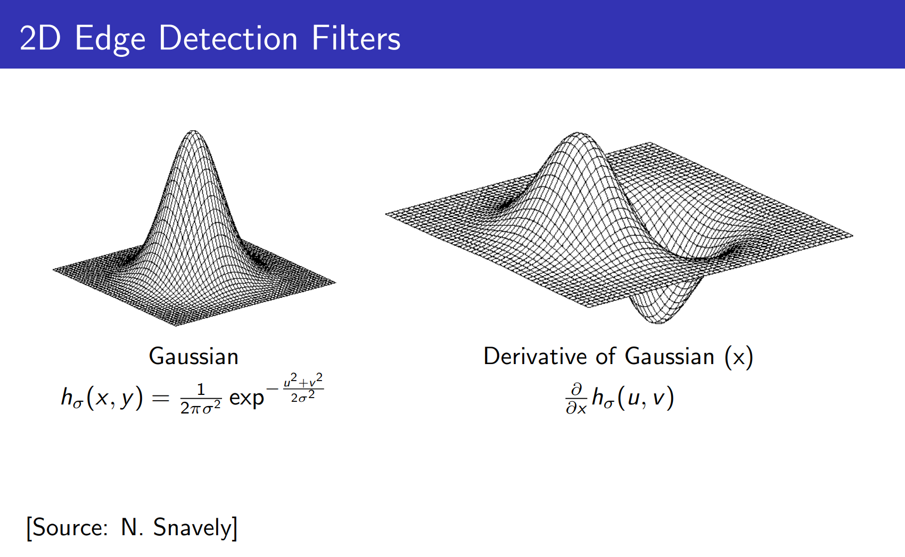

__Properties of applying the Gaussian derivatives__:

- Zero at a long distance from edge
- Positive on both sides of edge
- Highest value at some point in between, on the edge itself
- Effect of $\sigma$ on derivative (Gaussian's scale parameter):
  - Larger values: detects edges of larger scale
  - Smaller values: detect finer structures

__Canny Edge Detector__:

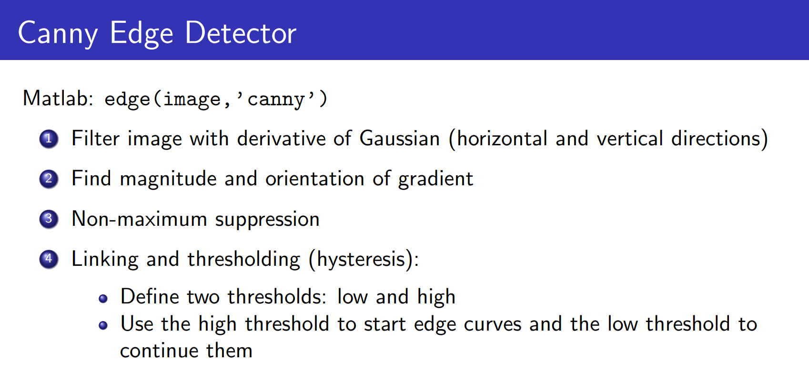

The algorithm will first detect strong edge (strong gradient) pixels above the `high_threshold`, and reject pixels below the `low_threshold`. Next, pixels with values between the `low_threshold` and `high_threshold` will be included as long as they are connected to strong edges. The output `edges` is a binary image with white pixels tracing out the detected edges and black everywhere else.

 ```python
import matplotlib.pyplot as plt
import matplotlib.image as mpimg
image = mpimg.imread('test.jpg')
plt.imshow(image)
# Convert to grayscale
import cv2  #bringing in OpenCV libraries
gray = cv2.cvtColor(image, cv2.COLOR_RGB2GRAY) #grayscale conversion
plt.imshow(gray, cmap='gray')
# Apply Canny Edge detector
edges = cv2.Canny(gray, low_threshold, high_threshold)
 ```

Note: cv2.Canny() applies a 5x5 Gaussian internally for smoothing. Large $\sigma$ (in step 1) detects "large-scale" edges and small $\sigma$ detects fine edges.

Note: Depends on several parameters: $\sigma$ of the blur and the thresholds.

__Laplacian of Gaussians__: Another way of finding edges

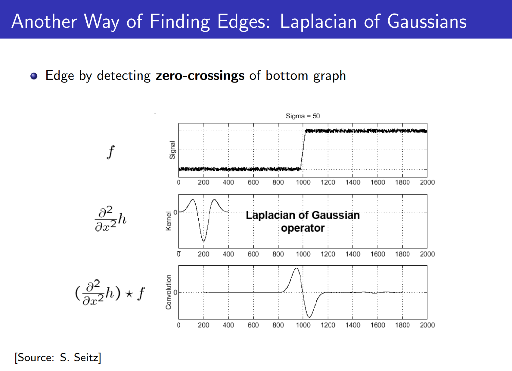


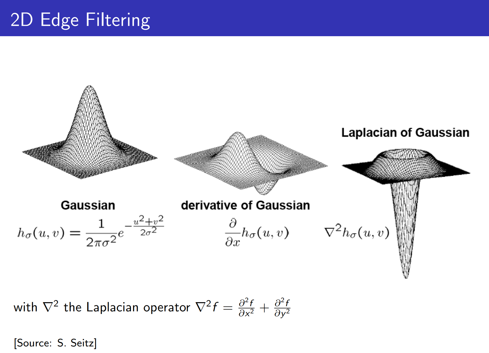

__Properties of applying the Laplacian operator to image__:

- Zero at a long distance from the edge
- Positive on the darker side of edge
- Negative on the ligher side
- Zero at some point in between, on edge itself

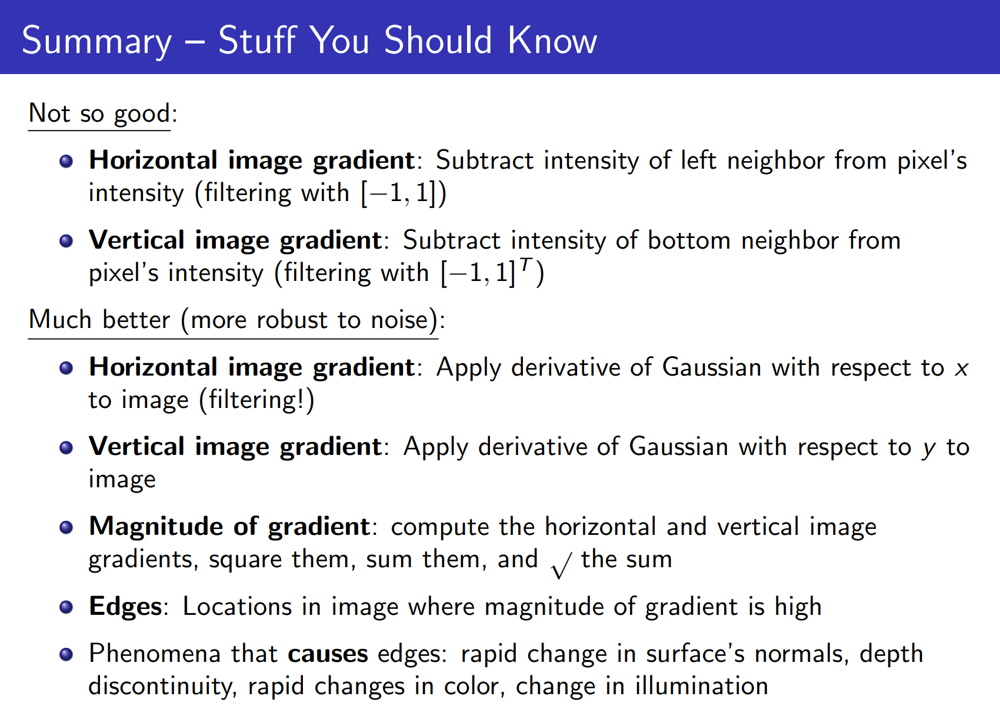


## Gradient Applications

1. _Seam Carving_ (content-aware image resizing)

   1. A vertical seam (**s**) is a list of column indices, one for each row, where each
      subsequent column differs by no more than one slot.
   2. Find path from top to bottom row with minimum gradient energy
      1. Can be computed via dynamic programming
   3. Remove (or replicate) those pixels

   


