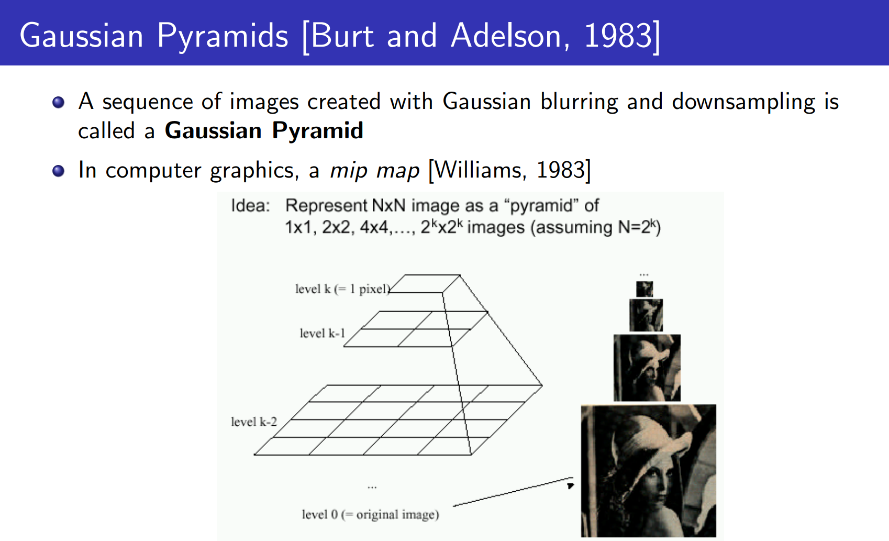
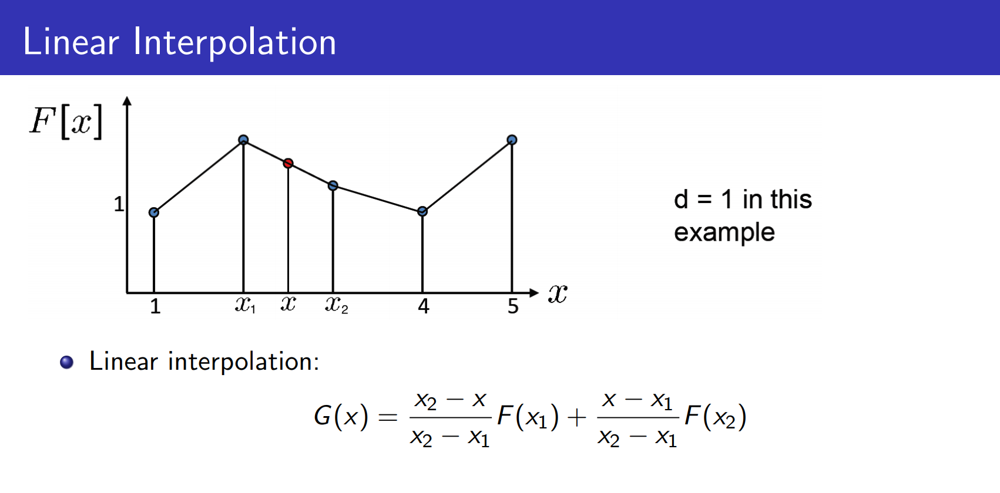
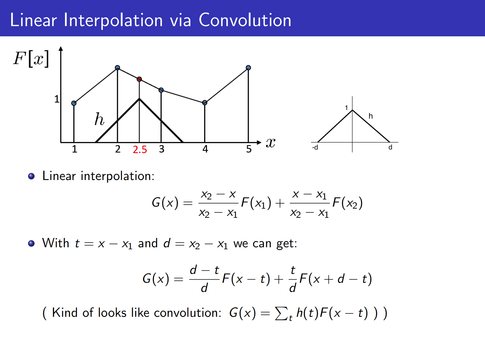
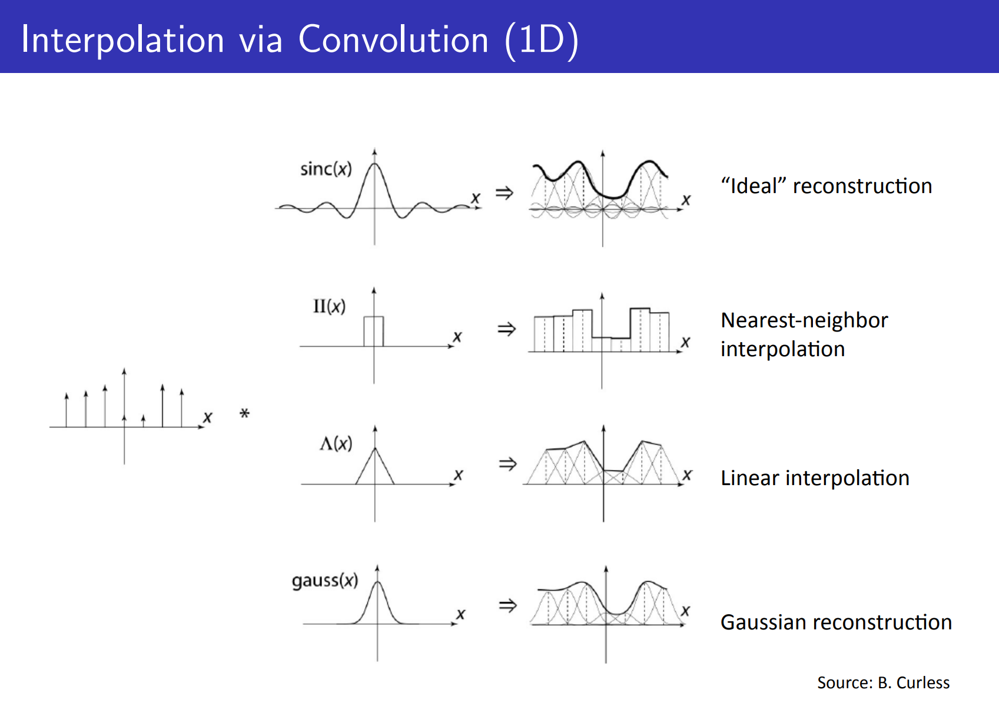
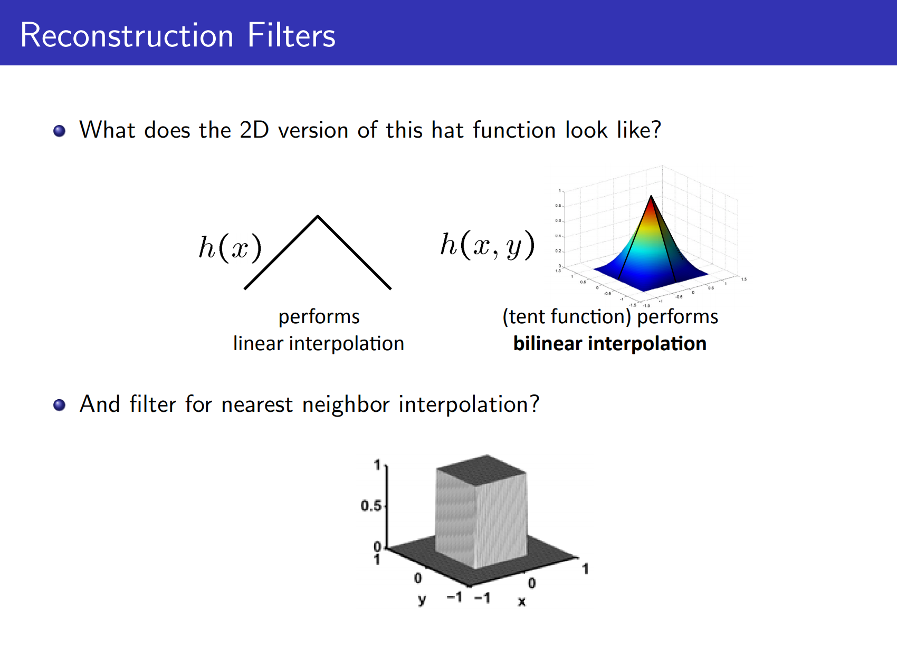

# Image Pyramids

## image sub-sampling

Naive idea: throw away every other row and column to create a 1/2 size image. Not good at all why:

__Aliasing__: when sampling rate is not high enough to capture the amount of detail in the image

**Nyquist rate**: The minimum required sampling rate (to reconstruct the signal)

- Find the highest frequency of the signal (Fourier Transform)
- Sample with at least twice as that frequency

In images, high frequencies are caused by sharp edges, so Blur (Gaussian pre-filter) the image before sub-sampling (using Naive method) 

## image up-sampling

Naive approach: repeat each row and column n times (Not good)

Image Interpolation in 2D: [bilinear interpolation](http://en.wikipedia.org/wiki/Bilinear_interpolation) and Bicubic

