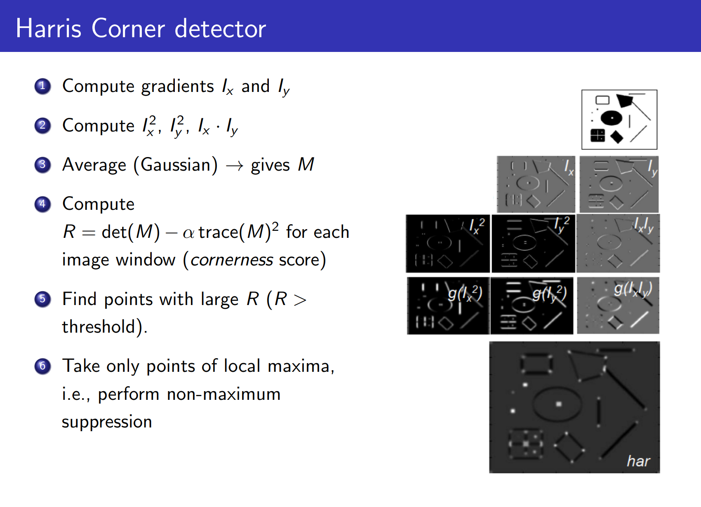

# Harris Corner Detection

## Image Features

useful descriptions of local or global image properties designed (or learned!) to accomplish a certain task.

In an image:

- Distinctive locations are __key-points__
- Distinctive features are __descriptors__

## Interest Point (key-point) Detection

Example: Image Stitching

## Interest Points: Corners

Shifting a window in any direction should give a large change in intensity, when the window is on top of a corner.

$E(0,0)$ is zero (compare a patch with itself).

Using a simple first-order Taylor Series expansion for $I(x+u, y+v)$:

- Columns of $V$ are __principal directions__
- $\lambda_1, \lambda_2$ are __principal curvatures__
- The eigenvalues of M ($\lambda_1, \lambda_2$) reveal the amount of intensity change in the two principal orthogonal gradient directions in the window
  - "flat" region: $\lambda_1$  and $\lambda_2$ are small
  - "edge" region: $\lambda_1 \gg \lambda_2$ or $\lambda_2 \gg \lambda_1$
  - "corner" region: both $\lambda_1, \lambda_2$ are large and $\lambda_1 \sim \lambda_2$

**Harris Corner Detector Properties:**

Ideal Properties: We want corner locations to be **invariant** to photometric transformations and **covariant** to geometric transformations. 

Invariance: Image is transformed and corner locations do not change

Covariance: If we have two transformed versions of the same image, features should be detected in corresponding locations

- Shift: Harris corner detector is shift-covariant (our window functions shift)
- Rotation: Second moment ellipse rotates but its shape (i.e. eigenvalues) remains the same 
  - Harris corner detector is rotation-covariant
- Corner location is **not scale invariant/covariant**!

